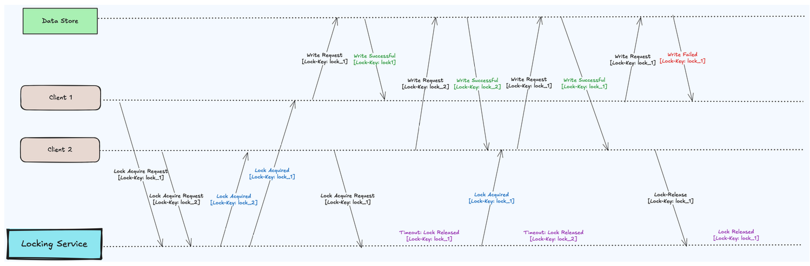
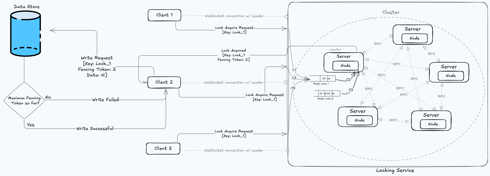

# Table of Contents

- [Getting Started](#getting-started)
- [Demo](#demo)
- [What is a Distributed Lock?](#what-is-a-distributed-lock)
- [Proposed Solution](#proposed-solution)
- [Functional Capabilities](#functional-capabilities)
- [System Design](#system-design)
  - [Core Components](#core-components)
- [APIs](#apis)
  - [HTTP Protocol](#http-protocol)
  - [WebSocket Protocol](#websocket-protocol)
  - [Remote Procedure Call (RPC) Protocol](#remote-procedure-call-rpc-protocol)
- [Implementation Detail](#implementation-detail)
- [How A Lock is Acquired](#how-a-lock-is-acquired)
- [How A Lock is Released](#how-a-lock-is-released)
- [Fault Tolerance: Graceful Lock Recovery from Leader Crashes](#fault-tolerance-graceful-lock-recovery-from-leader-crashes)
- [Challenges, Solutions & Further Improvement](#challenges-solutions--further-improvement)
- [References](#references)

# Getting Started  
Follow these steps to get the Locking Service application running on your machine.

#### 1. Clone the Repository

Clone the repository from GitHub using the following command:

```bash
git clone https://github.com/FitrahHaque/Distributed-Lock
```

#### 2. Navigate to the Project Directory

```bash
cd Distributed-Lock-main
```

#### 3. Install Dependencies

```bash
go mod tidy
```

#### 4. Run the Application

```bash
go run main.go
```

You will see a menu to choose actions to perform, including Data Store, Server, and Client operations.

<details>
    <summary style="font-size:2.0em; font-weight:bold;">Demo</summary>
Follow the steps below to run a demonstration of the distributed locking mechanism.

#### 1. Start the Data Store

Open a new terminal window within the `main.go` file's directory and execute:

```bash
go run main.go

# Select Data Store (option D)
D
```

#### 2. Launch Multiple Clients

Open 3 separate terminals and in each run:

```bash
go run main.go

# Select Client (option C)
C

# Assign each client a unique name:
1 client1
```

Repeat this for `client2` and `client3`.

#### 3. Set Up a Cluster of 5 Servers

Open 5 terminals. In each, run:

```bash
go run main.go

# Select Server (option S)
S

# Provide a unique Server ID (0 to 4):
1 0
```

Then, on terminals for servers 1-4, connect to server 0 to form the cluster:

```bash
# Connect to serverID 0
13 0 [::]:8080
```

Check the current leader status:

```bash
9
```

#### 4. Connect Clients to the Cluster

Run the following on each client terminal to connect to the cluster:

```bash
2 10
```

#### 5. Request, Use, and Release a Lock

On `client1`, acquire lock `l1` for 60 seconds:

```bash
3 l1 60
```

After the lock is acquired, write data to the store:

```bash
5 hi l1
```

Verify the write operation by checking the file `client/data.txt`.

Finally, release the lock:

```bash
4 l1
```

Check server terminals to verify the lock release status.

#### 6. Simultaneous Lock Requests

On `client2`, request lock `l1`:

```bash
3 l1 30
```

On `client3`, simultaneously request lock `l1`:

```bash
3 l1 30
```

`client2` will obtain the lock first. After 30 seconds, it will automatically pass to `client3`. Verify this by observing client and server logs.

#### 7. Leader Crash Simulation

Request lock `l2` simultaneously from all three clients:

```bash
3 l2 40
```

Initially, `client1` acquires the lock. Now simulate a leader crash (assuming the leader is server 0):

```bash
# Press Control-C-Enter to crash the leader.
```

Clients will automatically reconnect to a newly elected leader. Verify that pending lock requests are processed correctly by checking logs across terminals. Even though the request was initially queued on the previous leader, the handoff allows the new leader to process the pending requests smoothly.
</details>

---

# What is a Distributed Lock?

Imagine a “key” that lives out on the network: whichever service grabs it first gets exclusive access to a shared resource (like a file or database row). Once you’re done, you let go of the key so someone else can pick it up. It keeps everyone playing fair across multiple machines.
# Proposed Solution
We are going to implement Distributed Locking Service using Raft Consensus Algorithm. Because it
- Ensures synchronised and ordered write operations.
- Maintains a consistent lock state across all the nodes.
- Automatic failure recovery and quick assignment of locks safely.




# Functional Capabilities

1. **Distributed Locking**  
   Ensures only one client can hold a lock for a given resource at a time.

2. **Leader-Based Coordination (Raft)**  
   Elects a single leader to handle lock requests and replicate logs for consistency.

3. **Log Replication**  
   Propagates lock acquisition/release commands across all nodes so they agree on the lock state.

4. **Fencing Tokens**  
   Prevents stale writes by issuing a monotonically increasing token each time a lock is acquired.

5. **TTL and Auto-Expiry**  
   Automatically frees locks if a client fails to release them before a specified time-to-live elapses.

6. **FIFO Lock Queues**  
   Manages multiple pending lock requests in the order they arrive for fairness.

7. **WebSocket Client Interface**  
   Provides a persistent connection to the current leader for lock acquire/release notifications.

8. **HTTP-based Data Store**  
   Separates lock management from data persistence; applies fencing tokens to validate writes.

9. **Fault Tolerance & Recovery**  
   Detects leader crashes and reassigns locks by reading from the replicated log/state; clients retry automatically.

10. **Scalable Cluster Membership**  
    Allows new servers to join or existing ones to leave via Raft-based consensus (Add/Remove Server).

These features work together to create a scalable, consistent, and fault-tolerant lock service for distributed systems.


# System Design

## Core Components

1. **Data Store**  
   A dedicated server listens on port `8000` and maintains a simple text file for persistence. Although not distributed in this implementation, it serves to demonstrate interaction with our distributed lock mechanism. The data store exclusively handles client communications.

2. **Client**  
   Clients connect to the server cluster to acquire or release locks and issue write requests. Multiple clients can be spawned to simulate lock scenarios. After acquiring a lock on a specific key, the client sends a write request to the data store.

3. **Cluster**  
   A group of servers participating in consensus. The system tolerates failures as long as a majority of nodes are operational. We assume a single cluster without advanced features like hinted handoff.

4. **Server**  
   Each server has a unique `serverID`. Servers handle RPCs on ports starting at 8080 and WebSocket connections on ports starting at 50500 (offset by serverID). Every server hosts one Raft node; networking is abstracted from Raft logic.

5. **Node**  
   Implements all Raft logic: makes RPCs, coordinates consensus, grants locks, and replicates operations. It’s the core of the distributed locking service.

6. **Log Entry**  
   Each node keeps an in-memory structure called the **Log**. The Raft algorithm maintains consistent logs across nodes. Log entries are committed once a majority of nodes acknowledge them. Each entry represents a command:
   - Add Server
   - Remove Server
   - Append Data
   - Lock Acquire
   - Lock Release 

   This flexible model supports both **cluster membership changes** and **application-level operations**, like distributed locking.

7. **Request Queue**  
   Each node maintains a FIFO queue for lock requests, organized by key. When a lock is released, the next request in the queue is processed. This minimizes polling by notifying clients when their request is granted.

8. **Local Key-Value Store**  
   Each node has a persistent key-value store for log entries, lock metadata, and internal state.

9. **Remote Procedure Call (RPC)**  
   Servers use Go’s built-in RPC library (`net/rpc` package) to communicate. This propagates lock operations and ensures consensus across nodes.

10. **WebSocket**  
    Clients connect to the leader via a persistent WebSocket to issue lock requests. The same connection is used to notify the client upon success.

11. **HTTP**  
    Once a lock is acquired, the client writes to the data store using HTTP POST. This decouples lock handling from data persistence.

12. **Fencing Token**  
    When a lock is granted, the server issues a monotonically increasing token. The client includes this in its write request to ensure stale or duplicate requests are rejected if a disconnect occurred.

> A detailed view of interaction among Locking Service core components is given below:




# APIs

Below are explanations of all the APIs we’ve used and their roles in our design. We’ve added the request and reply bodies in a simplified pseudo-TypeScript format for better understanding.

## HTTP Protocol  
**Write Data**  
The client communicates with the Data Store via an HTTP POST request to write data. Along with the request, it includes the fencing token provided by the locking service. The Data Store uses the token’s key and value to determine whether the write is valid, ensuring that only the latest, authorised requests are accepted and preventing stale writes.
```ts
interface WriteRequest {
    "clientID": string
    "fencingToken": {
	"key": string
        "value": number
    }
    "data": string
}


interface WriteResponse {
	"success": boolean
}
```

## WebSocket Protocol  
**Lock Acquire-Release**  
After establishing a connection with the leader of the locking service, the client sends a lock acquisition request for a key. This allows for more accurate resource distribution as per request. The request includes a TTL (Time-To-Live) value, which specifies how long the client intends to hold the lock. This TTL allows the server to automatically release the lock after the specified duration, even if it does not receive an explicit release request from the client. This mechanism helps ensure fairness and prevents indefinite lock holding due to client failure or disconnection.  
If the server grants the lock, it responds over the same WebSocket connection with a message indicating success, along with a fencing token associated with the lock key.  
To release the lock, the client sends a release request using the same message format. However, no response is sent back from the server, as acknowledgment is not strictly necessary.  
>The persistent WebSocket connection allows the client to wait passively for server notifications, eliminating the need for polling. This architecture reduces server load and keeps the server in control of lock state transitions.  
```ts
interface LockRequest {
	"commandType": number
	"key":         string
	"clientID":    string
	"ttl":         number 
}

interface LockAcquireReply {
	"success": boolean
	"fencingToken": {
	"key": string
	    "value": number
	}
}
```

## Remote Procedure Call (RPC) Protocol  
1. **Join Cluster**  
    When a new server intends to join the Raft cluster, it must first know the address of at least one existing server. Since only the current leader has the authority to add new servers to the cluster, the joining server must eventually connect to the leader node. Our implementation **avoids single point of failure** by not choosing a design with a centralized master server for connecting.  

    This RPC handles the join request by forwarding it to the current leader. Upon finding the leader, it receives information about the current term.  

    To locate the leader, the new server initiates connections with known peers, **hopping from one server to another until it finds the node that acknowledges itself as leader.**  

    However, due to the possibility of network partitions, the joining server might connect to a node that believes it is the leader but is, in fact, outdated. We refer to such a leader node as a `potential leader` because **it may not be part of the latest term or quorum.**    

    Despite this uncertainty, the **Raft consensus protocol ensures safety**:   
    * A new server is added to the cluster only if the node it contacted is indeed the current leader.  
    * The addition must be replicated and acknowledged by a majority of the cluster.  
    * Outdated or partitioned nodes cannot impact consensus, as they lack communication with the majority.  

    ```ts
    interface JoinClusterArgs {
        "serverId":   number
        "serverAddr": string
    }

    interface JoinClusterReply {
        "success":    boolean
        "leaderId":   number
        "leaderAddr": string
        "term":       number
    }
    ```
2. **Fetch Peer List**  
    After establishing a connection with a server it believes to be the leader, the joining node sends a request to fetch the list of peers and their addresses. However, it’s possible that **a new leader election has occurred** between the time the join request was initiated and the peer list request was sent. If the contacted server is still the leader, it responds with the current peer list. Otherwise, it informs the joining node of the new leader’s identity.  

    The joining node will then attempt to connect to the new leader and fetch the peer list again. To avoid indefinite redirection in the case of network instability, this retry mechanism is limited to a maximum of 5 attempts. If it still cannot find the correct leader within these retries, the join process fails gracefully.  

    Fetching the peer list does not require consensus across the cluster, as the information is not critical to maintaining consistency.  
    ```ts
    interface FetchPeerListArgs {
	    "term": number
    }

    interface FetchPeerListReply {
        "success":    boolean
        "term":       number
        "leaderId":   number
        "leaderAddr": string
        "peerSet": { 
            [id: number]: any 
        }
        "peerAddress": { 
            [id: number]: string 
        }
    }
    ```

3. **Request Vote**  
    When a candidate node starts a new election, it sends a Request Vote RPC to all its peers. If it receives votes from a majority of the nodes, it is elected as the leader for that term.  

    However, voting for a candidate is not trivial. Raft enforces a strict safety invariant:   
    **At most one leader can be elected per term.**  

    This invariant is upheld by the design of this RPC, more specifically, the voting conditions. A follower grants its vote to a candidate only if all of the following conditions are met:  
    * **Candidate’s Term is Current or Higher**  
        The candidate must be requesting votes for a term that is greater than the follower’s current term.  
    * **Follower Hasn’t Voted Yet**  
        The follower has not already voted in this term, or it has previously voted for the same candidate.  
    * **Candidate’s Log is Up-to-Date**  
        The candidate’s log must be at least as up-to-date as the follower’s. This is determined as follows:  
        - If the term of the candidate’s last log entry is strictly greater than that of the follower’s, the candidate is more up-to-date.  
        - If both terms are equal, then the candidate’s log is up-to-date if it is at least as long as the follower’s.  
    
    These conditions ensure that:  
    * No two leaders can exist in the same term, even in the case of network partition.  
    * The newly elected leader has all the most recent log entries.  

    If any of the above conditions is not satisfied, the follower denies the vote request, and the candidate must try again in a later election round.  

    It’s important to note that the **current leader may have a shorter commit index** than some peers, even those who voted for it. However, since its log entries are from a more recent term, they are authoritative. As the leader continues operating, it receives acknowledgment about these newer entries propagated to majority nodes. This causes the leader’s commit index to catch up naturally, ensuring consistency without any harm.  
    
    ```ts
    interface RequestVoteArgs {
	    "term":         number
	    "candidateId":  number
	    "lastLogTerm":  number
	    "lastLogIndex": number
    }

    interface RequestVoteReply {
        "term":        number
        "voteGranted": boolean
    }
    ```

4. **Append Entries**  
    The Append Entries RPC is used by the leader to send log entries to its peers and to periodically send heartbeats. When new log entries are available, the leader appends them to the follower nodes. If no new entries exist, the leader still sends a heartbeat after a fixed timeout so that followers can confirm they are still connected to the current leader.  

    ### Argument Structure and Its Role  
    When sending an Append Entries request, the leader includes several critical pieces of information:  
    * **Leader Identity**  
        The leader sends its own ID and term so that the follower can verify that the request comes from a legitimate, current leader.  
    * **Follower Log State**  
        The leader maintains its own view of each follower’s log (stored in **in-memory map** structures called `next index` and `matched index`). It sends the last log index that the follower has acknowledged, along with the term associated with that entry.  
        - If the last log index is 0, it indicates that the leader doesn’t have any information about the follower’s log (for example, if the leader was elected recently); in that case, the leader includes all entries in its log.  
        - This information allows the follower to determine if its log is consistent with the leader’s. If inconsistencies exist, the leader can send only those entries that the follower is missing, rather than transmitting the entire log.  
    * **New Log Entries**  
        The leader transmits an array of log entries that it believes the follower has not yet seen. When the array is empty, the request functions purely as a heartbeat.  
    * **Commit Index**  
        Finally, the leader includes its commit index, which indicates that all entries up to that index have reached consensus. The follower uses this value to decide which entries to apply locally.  
    
    ### Follower Consistency Checks   
    When a follower receives an Append Entries RPC, it performs a series of checks before appending the new entries:  
    * **Term Verification**  
        The follower checks that the leader’s term is not outdated relative to its own current term. If the leader’s term is lower, the request is rejected.  
    * **Initial Synchronization**   
        If the leader’s provided last log index is 0, it implies this is the first append operation from a newly elected leader. In this case, the follower accepts all the provided entries directly.  
    * **Log Consistency Check**   
        If the leader already knows the follower’s log state (i.e., the last log index is greater than 0), the follower verifies that the entry at that index matches the term specified by the leader.  
        - If they match, the follower accepts the new entries.  
        - If they don’t match—indicating stale or diverging entries, the leader typically has to try again with a log index one less next time. However, the follower doesn’t reject the request outright. Instead, **it provides the leader with recovery information**:
            * If the leader’s last log index is greater than the follower’s log length, the recovery index is set to the follower’s current log length, and **recovery term is set to 0.**
            * If there is a conflict (i.e., the term of the entry is different), while recovery term contains the conflicting term, the **recovery index identifies the last index added before the conflicting term**, allowing the leader to re-send all subsequent entries at once, in case the leader considers all the entries since that term as dirty.  

    This recovery mechanism enables the leader to catch up a follower quickly by replacing multiple conflicting or missing entries in one go.  
    ```ts
    interface AppendEntriesArgs {
        "term":         number
        "leaderId":     number
        "lastLogIndex": number
        "lastLogTerm":  number
        "entries": {
            "command": any
            "term":    number
        }[]
        "leaderCommit": number
    }

    interface AppendEntriesReply {
        "term":          number
        "success":       number
        "recoveryIndex": number
        "recoveryTerm":  number
    }
    ```

5. **Append Data**  
    To ensure consistency, all write and read operations must go through the current leader. The RPC is used to submit these operations, which the leader appends as log entries.  
    These entries are replicated to follower nodes via Raft. Once a majority acknowledges them, the leader commits and applies the changes to the state machine. This guarantees consistent ordering, prevents stale read.  

6. **Remove Server**  
    Any server who wants to remove itself from the cluster can use this RPC.  

# Implementation Detail  

>The code is implemented entirely in Go.  

## How the Raft Cluster Operates  

### Node’s Role As A Follower  
**Tracks Leader Heartbeats**  
- Every node begins as a follower.  
- The leader sends periodic heartbeats (AppendEntries RPCs) to followers.  
- Each follower runs an **election timer** in a background goroutine with a **randomized timeout**.  
- On receiving a heartbeat:  
    * The follower resets its election timer.  
    * Updates the term if needed.  
    * Stops the goroutine and runs another with the updated information.   
- If no heartbeat is received before the timeout:  
    * The follower transitions to candidate and starts a new election.  
    * Stops the goroutine.  
- Continuously tracking timeout is costly.  
- To optimize, we use a Go ticker that ticks every 10ms.  
    * The election check runs periodically (every 10ms) instead of continuously.  

### Node’s Role As A Candidate  
**Initiates Election**  
- Increments current term.  
- Sends `RequestVote` RPCs to all known peers.  
- If any peer replies with a higher term, the node **steps down to follower**.  
- If it receives votes from a majority, i.e., strictly more than half of the number of peers, it **becomes the leader for that term.**  
- Election timeout is **randomized** to prevent all nodes from starting elections simultaneously, reducing network overload.  

### Node’s Role As A Leader  
1. **Adds New Log Entries**  
    When new log entries are appended, the leader processes them according to their **command type**.  
    * **Read:** Not written to the log; the value is directly fetched from storage using the key.  
    * **Write:** Appended to the log → replicated to followers → committed → stored in persistent storage.  
    * **Add Server:** Connected to the peer → appended to the log → replicated → committed → added to the peer list.  
    * **Remove Server:** Appended to the log → removed from the peer list → replicated → committed → disconnected from the peer.  
    * **Lock Acquire/Release:** Handled through dedicated logic, discussed in a later section.  

2. **Sends New Entries to Followers**  
    - Once a node becomes the leader, it **spawns a `goroutine`** that continues to run as long as the node remains in the Leader state.  
    - The goroutine:  
        * Tracks the elapsed time since the last heartbeat was sent.  
        * If the heartbeat timer expires, it sends an `AppendEntries` RPC to all followers.  
        * The function also listens to a **Go channel** named `trigger`.  
        * When a new log entry is added, the **channel is signalled** to notify the goroutine that new data must be replicated.  
        * This allows the leader to **immediately react** to changes, rather than waiting for the heartbeat timeout alone.  
    - The leader maintains an `in-memory map` to track the next log index to send to each follower. When the leader issues an `AppendEntries` RPC:  
        * **Success Case**  
        If the `AppendEntries` RPC succeeds for a follower, the leader checks each entry it sent to verify whether a majority of nodes have acknowledged that entry. Once a log entry is acknowledged by a quorum, the leader commits it and immediately triggers another `AppendEntries` RPC to notify followers about the newly committed entry.  
        * **Failure Case (Conflict Resolution)**  
            If the `AppendEntries` RPC fails for a follower, rather than decrementing the `next index` (stores follower’s log-state from the leader’s viewpoint) one by one, the leader uses the `recovery index` and `recovery term` returned by the follower to quickly realign the follower’s log:  
            * **Recovery Term is 0:** This indicates that the follower’s log is shorter in length than the leader assumed. In this case, the leader **sets the next index to the `recovery index`**, assuming that all log entries up to that point are consistent. It will then send entries starting after the `recovery index`.   
            * **Recovery Term is Greater Than 0:** This means that at the specified recovery index, the follower’s log contains an entry from a term that conflicts with the leader’s. The leader then optimistically searches backward in its own log to find the last index that matches the recovery term. This step leverages the possibility that although there is a conflict, the follower may still contain some valid entries from that conflicting term.  
                - If the leader finds a matching index, it uses that index as the starting point for further `AppendEntries` RPCs.  
                - If no matching index is found, the leader falls back to using the `recovery index` provided, that **contains the latest index with non-recovery term**, as the `next index` for that follower, thereby replacing all subsequent entries in the follower’s log (considered ***“dirty”***) with the leader’s entries.  

    This mechanism enables the leader to rapidly bring a follower’s log into consistency with its own, minimizing the number of RPCs required when conflicts occur.  


# How A Lock is Acquired  
## Client’s Leader Discovery & Lock Acquisition  
* **Peer Selection & Connection**  
    The client randomly selects one of the known peers and attempts to connect. The chosen peer responds with information about the current leader. The client then connects to the leader using **WebSocket Protocol**.  
* **Multi-Hop Discovery**  
    It is possible that by the time the reply reaches the client, a new leader has been elected. In such cases, the discovery service is **designed to follow multiple hops** until it locates a node that **identifies itself as the current leader**.    
    >Note that during network partitions, there is a risk that the client might be redirected to an outdated leader.  
* **Lock Acquisition**  
    The client is allowed to send a lock acquire request only when it is connected to the leader. Once connected via WebSocket, the client waits for a success message from the leader before proceeding.  
* **Handling Disconnections Transparently**  
    If the leader disconnects while the client is waiting for a reply, the discovery service automatically detects the loss of connection and re-initiates the leader discovery process. **Once reconnected to the new leader, the client automatically resends the original lock acquire request.** Therefore, the process remains transparent to the user.  
* **Acquiring Multiple Locks Simultaneously**  
    Even after acquiring a lock, the persistent WebSocket connection remains open for subsequent operations. Since locks are based on keys, the client can concurrently issue lock requests for different keys, allowing it to hold multiple locks simultaneously.  

## Logging Requests 
* **FIFO Queue for Lock Requests**   
    When the leader receives a lock request, it appends the request to a FIFO queue, specific to that lock key. Since Go does not have a native queue data structure, this queue is implemented as an in-memory map named `pendingLockQueue`. For each new lock key, a queue is created if one does not already exist.  
* **Persisting the Lock-Key**  
    To avoid conflicts with other keys in our key–value store, **every lock key is prefixed with a designated string**. This naming convention clearly **distinguishes lock keys from other stored data**.  
* **Processing the Queue**  
    **When a lock is released for a particular key**, the leader ***“pulls”*** the **next request from that key’s queue**. This method **eliminates the need for clients to continuously poll the server** and thus reduces load on the system.  
* **Immediate Processing When Lock is Free**  
    If a lock is not currently held, the leader processes the request immediately while still adding it to the queue. To accomplish this, a dedicated **Go channel—`pullLockRequestChan`**—is maintained for **each key**. This channel acts as a trigger, allowing **various parts of the system** to notify the central logic that a queued request should be processed.  
* **Goroutine for Queue Management**  
    Separate goroutines monitor these channels continuously. When a notification is received on `pullLockRequestChan` for a specific key, the associated goroutine retrieves (pulls) the first request from the corresponding FIFO queue and processes it.  
* **Fencing Token**   
    Before a lock request is appended as a log entry, the leader retrieves the current fencing token from the database, increments it by one, and associates the new value with the lock request. This log entry is then submitted into the Raft replication pipeline to ensure that the lock acquisition is managed consistently across the cluster.  
* **Expiry Time**  
    When a request is appended, the leader includes an expiry timestamp along with the log entry. This timestamp is computed by adding the **TTL (Time-To-Live)** received in the request to the **leader’s local clock**.  
    Once this log entry is replicated and committed across the cluster, all nodes store the same expiry time for the lock. This ensures consistency regarding when the lock should automatically expire, even if the client does not explicitly release it.  
    It is important to note that this approach **assumes the leader’s clock is reasonably accurate**. In real-world distributed systems, ***clock drift*** can lead to inconsistencies across nodes. However, in our system, we intentionally ignore clock synchronization issues for simplicity, assuming all nodes trust the leader’s clock for the expiry.  


## Lock Acquiring  
1. **Appending the Request to the Log**  
    The leader treats the request as a command and appends it to its log, just like any other operation. This log entry is then replicated to follower nodes as part of the Raft protocol.  
2. **Log Replication and Commitment**  
    Once the leader receives acknowledgments from a majority of the nodes, the log entry is committed. Raft guarantees that **once an entry is committed, no other operation can hold the same lock concurrently**. This invariant ensures that even if the **leader crashes**, the committed request remains in the log and will eventually be **processed by the new leader**.  
3. **Updating Node State**   
    After commitment, all nodes update their internal state to reflect the new lock status. At this point, the system guarantees that the lock is available and that no other client is holding it.  
4. **Ignoring Expired Locks**  
    Raft ensures that all nodes in the cluster receive the log entry for a lock acquisition, but **it does not guarantee when each node will process that entry**. As a result, a follower might apply the log entry **after the lock has already expired**. To prevent incorrect updates, each node checks the expiry time before modifying its local lock state. If the lock has expired by the time the log is processed, the node ignores the entry. This ensures that outdated lock information doesn’t cause inconsistencies, even when log processing is delayed.  
5. **Client Notification**  
    If the node processing the committed entry is the leader, it promptly notifies the client—using the same persistent WebSocket connection the client used—that the lock has been acquired. This immediate communication ensures the client receives the lock acquisition confirmation as soon as the system’s state is consistent.  


# How A Lock is Released  
## Client-Initiated Release Request  
* **Initiating a Release**  
    When a client has completed its operations with a lock, it can initiate a release request. This request informs the server that the lock is no longer required.  
* **Asynchronous Communication**  
    The release request is sent asynchronously. This means the client sends the release command over the established **WebSocket** connection without waiting for or expecting a response from the server.  
* **Usage Constraint**
    The release request is only made if the client still considers itself to hold the lock, ensuring that the request is valid from the client’s perspective.  

## Server-Initiated Release Request  
* **Automatic Lock Release Mechanism**  
    Once a lock is acquired, the leader ensures that the lock will eventually be released—either because its **TTL (Time-To-Live) has expired** or due to an **explicit forced release** request. To manage this, the leader launches a dedicated background **goroutine** that monitors both releases.  
* **Monitoring via a Dedicated Goroutine**  
    The leader spawns a goroutine that uses **Go’s context and time packages** to wait **efficiently** without constant resource consumption. **This goroutine remains idle until one of two activation events occurs.**  
* **Activation Criteria**  
    The monitoring goroutine is triggered by either  
    * **Forced Release:** An explicit cancellation of the lock’s context signals that the lock should be released.  
    * **TTL Expiry:** A timer set using `time.After` expires when the lock’s TTL is reached.  
    
    When either event occurs, the goroutine’s **sole task is to append a release command** for the lock to the log.  
* **Efficient Resource Use**  
    After appending the release command to the log, the goroutine terminates. This design minimizes resource usage by activating the monitoring process only when a lock is actually due for release, allowing the system to remain efficient when no action is required.  


## Lock Releasing  
* **Immediate Leader Update**
    Once the leader appends a log entry for a lock release, it immediately updates its state to reflect that **the lock is no longer held**. This update includes **removing the key from the database** to indicate that no client currently holds the lock, and **deleting the associated context cancellation method** after ensuring that the background goroutine monitoring the lock is properly terminated.
* **Replication Across the Cluster**
    After the leader updates its own state, the release command is replicated to all nodes in the cluster via the Raft protocol. They also immediately update their states.
When a quorum of nodes applies the release command, the entire cluster is synchronized and acknowledges that the lock has been released.
* **Processing the Next Request** 
    With the release committed, the leader **signals the `pullLockRequestChan` channel** for the affected lock key. This signal prompts the leader to **retrieve the next pending request** from the FIFO queue, allowing the lock acquisition pipeline to continue **without requiring additional client polling**.


# Fault Tolerance: Graceful Lock Recovery from Leader Crashes  
Leader failures are an inherent risk in distributed systems. **When a leader crashes while holding locks, those locks may not be properly released**. Consequently, even after a new leader is elected, the locks can remain “held,” preventing other clients from acquiring them. **Raft Algorithm alone does not address this issue**, so additional measures are required.  
* **Retrieving Lock Metadata (Handoff)**  
    To mitigate this problem, our design leverages the **underlying key–value data store** as the **definitive source of truth for lock status**, since its **consistency is maintained via Raft consensus**.   
    When a lock is acquired, a corresponding key is created in the database. This key is **explicitly deleted when the lock is released**. Therefore, **any lock whose key remains in the database is still considered held**.   
    Upon assuming leadership, the new leader queries the database to determine **which locks remain active and retrieves relevant metadata (i.e., lock owner and expiry time)**.   
* **Monitoring Already Held Locks**  
    Once the new leader has identified the held locks, it **spawns dedicated goroutines to monitor these locks**, similarly as explained before. This monitoring process ensures that, over time, each lock is safely released.  
* **Reconstructing Queue with Pending Requests**  
    During the leader transition, the **in-memory queues for pending lock requests are lost**. However, on the client side, lock requests are automatically retried in the event of a leader failure. As a result, the new leader is able to **reconstruct a similar queue with the same pending requests** even if the request order may differ.  
* **Transparent Recovery**  
    This recovery mechanism is entirely transparent to clients and follower nodes, ensuring that no request is lost and that operations continue smoothly. The new leader’s additional steps maintain overall system consistency and enable graceful recovery from leader crashes.  


# Challenges, Solutions & Further Improvement  
1. **Monitoring Heartbeats and Election Timing**  
    **Challenge**  
    Monitoring heartbeats and starting elections when the leader is unreachable was a major challenge. We struggled to implement an efficient election timer. This led to repeated elections and infinite election loops when communication was unstable.  
    **Solution**  
    We integrated Go’s channels as triggers with a ticker that fires every 10 milliseconds. This design reduced CPU overhead by waking the monitoring goroutine only periodically (or when a new heartbeat is received), preventing runaway elections while ensuring timely detection of leader failures.  
2. **Deciding Which Commands Require Consensus**  
    **Challenge**  
    Deciding which commands needed full consensus was complex. For example, removing a server from the cluster seemed simple, but it was unclear if every command, like adding a server, should follow the same consensus mechanism. The challenge was to balance consistency, especially during network partitions, with performance, ensuring only critical system state operations had full consensus.  
    **Solution**  
    Critical operations—those affecting the cluster’s integrity (like server additions or network partitions)—must go through consensus to prevent inconsistencies due to outdated or incomplete information. Less critical operations can be processed directly. Our design ensures network partitions don’t compromise the overall consensus invariant, even with added overhead for certain commands.  
3. **Eliminating Stale Writes**  
    **Challenge**  
    To prevent stale writes from corrupting the data store, our distributed lock system needed to handle scenarios where a client held a lock but failed or lost connection before releasing it. Without proper handling, the system might accept an outdated write, rendering the lock mechanism ineffective.  
    **Solution**  
    We introduced fencing tokens—monotonically increasing counters generated by the locking service and included in lock acquisition responses. The data store uses these tokens to determine if an incoming write is the latest or stale, ensuring only the latest valid write is processed. This approach mitigates the risk of dirty or outdated writes in client failure or delayed release scenarios.  
4. **Efficient Background Task Management**  
    **Challenge**  
    Processing background tasks—such as monitoring lock expiry—required careful design to avoid wasting CPU resources. Initially, our approach to continuously check timers for each lock was resource-intensive and not scalable, particularly under high load.  
    **Solution**  
    We designed a system where background tasks remain idle until triggered. Each lock has an associated monitoring goroutine that activates only when its TTL is exceeded or when a forced release occurs. This on-demand activation minimizes overhead and ensures efficient resource usage.  
5. **Handling Leader Crashes and Request Loss**  
    **Challenge**  
    A leader crash can prevent locks held by the leader from being released, causing pending lock requests to be indefinitely blocked. Additionally, the leader’s in-memory FIFO queues, which store pending log requests, are lost when the leader fails, potentially losing these requests.  
    **Solution**  
    When a new leader takes over, it queries the persistent storage for held locks and metadata. It then reconstructs the FIFO queues for pending lock requests and spawns background processes to monitor and release expired locks. This ensures no lock request is lost and the system recovers gracefully from leader failures.  
6. **Maintaining Monotonic Fencing Tokens Across the Cluster**  
    **Challenge**  
    Ensuring that fencing tokens remain monotonically increasing across all nodes in the cluster proved challenging. Relying solely on appending the log entries in the correct order and retrieving directly from the database for the latest token value was insufficient, as multiple lock acquisitions might be in-flight and uncommitted at the time of the retrieval. This can lead to potential inconsistencies where the database might not reflect the most recent lock state.  
    **Solution**  
    Currently, we are only retrieving the token value when we are pulling the next request out of the queue. And it only happens when the channel has been triggered. Which essentially means that no one is holding the lock right now. So it is safe. 
Although this is not a long-term solution and has potential risks, it seems to address our concern properly as of now.  
7. **Mitigating Byzantine Attacks—High Fencing Token Manipulation**  
    **Challenge**  
    There is a potential security issue where a malicious client might attempt a Byzantine attack by sending a very high fencing token with a lock acquisition request. Such an attack could force outdated writes to be accepted, undermining the reliability of the locking service.  
    **Solution (Planned/Future Work)**  
    Initially, our simplified design separated the data store and locking service, making it vulnerable to attacks. Future versions will integrate these components. This will involve designing an authentication token using an encryption algorithm to validate the fencing token via stateless communication without overloading the server. The server will then regenerate and verify the fencing token based on clientID, and other metadata. Currently, we prioritize core functionality and system reliability, skipping detailed Byzantine attack mitigation.  
8. **Log Divergence and Inconsistency**  
    **Challenge**  
    There are scenarios where some uncommitted log entries can affect a node’s state. For example, when processing commands like server removal or lock release, a follower may change its state before the entry is fully committed. If these uncommitted entries are later replaced by a new leader’s log, inconsistencies can arise, potentially causing a server to be mistakenly removed from the peer list or a lock to be considered released on a follower even though it’s not.  
    **Solution(Planned/Future Work)**  
    Currently, our system acknowledges these rare inconsistencies, accepting that it may not fully synchronize in such niche scenarios. Future work will involve designing additional reconciliation processes to re-add mistakenly removed peers or ensure consistent lock states across nodes, even with asynchronous log application.  


# References  
1. [Nice visualization of Raft Algorithm](https://thesecretlivesofdata.com/raft/)
2. [Raft Consensus Algorithm Explanation](https://www.youtube.com/watch?v=uXEYuDwm7e4&list=PLeKd45zvjcDFUEv_ohr_HdUFe97RItdiB&index=18&ab_channel=MartinKleppmann) by Martin Kleppmann is the best our there.  
3. [Great implementation of Raft Consensus Algorithm.](https://github.com/debajyotidasgupta/raft-consensus) Our work is highly inspired from it.  
4. [System Design](https://youtu.be/szw54UbPJRE?si=Jiptq5u4YZAboL5n) is provided by Jordan Has No Life.  